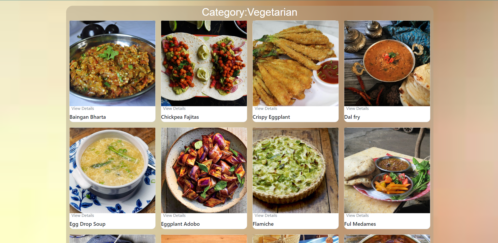

# Recipe React JS App by Bisalieva Asima

This web application runs on local host and uses TheMealDB API. The project was written based on requirements for Advanced Frontend final exam. The web application uses React Hooks(useEffect, useParams etc.), React Redux, fetchAPI and functional components.

Main Page:

Main Page meal list:

Main Page categories dropdown:

Meal Page:

